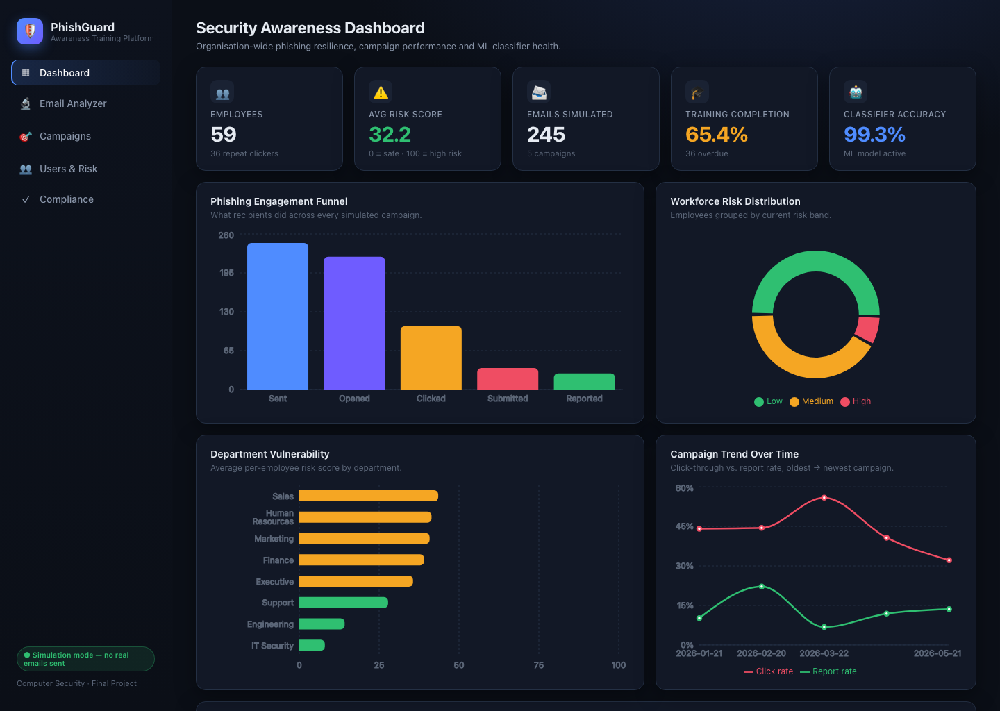

# 🛡️ PhishGuard — Phishing Detection & User Awareness Training Platform

A demo platform that simulates phishing campaigns for **security-awareness
training**, tracks how employees respond, scores each user's risk, and
recommends personalised micro-training — backed by an **NLP phishing
classifier**. Built as a Computer Security final project.

> **Simulation only.** No real emails are ever sent. Every "send", "open",
> "click" and "report" is generated inside the platform for training analytics.



---

## What it does (maps to the brief)

| Requirement | Where it lives |
|---|---|
| **NLP-based phishing email classifier** | `backend/ml/` — TF-IDF + Logistic Regression trained on a labelled corpus, with an explainable rule engine. Live demo on the **Email Analyzer** page. |
| **Simulated spear-phishing campaign builder** | `backend/services.py` (`simulate_campaign`) + **Campaigns** page. Pick a template, audience and difficulty, launch, and watch tracked responses. |
| **Per-user risk scoring & training recommendations** | `recompute_user_risk()` + `assign_training()` in `services.py`. **Users & Risk** and per-user detail pages. |
| **Dashboard with campaign analytics & compliance reporting** | **Dashboard** (funnel, risk distribution, department vulnerability, trends, classifier health) and **Compliance** (per-department completion, exportable CSV). |

---

## Architecture

```
┌──────────────── frontend/ (React + Vite + Recharts) ───────────────┐
│  Dashboard · Email Analyzer · Campaigns · Users & Risk · Compliance │
└───────────────────────────────┬────────────────────────────────────┘
                                 │  /api  (proxied)
┌───────────────────────────────▼────────────────────────────────────┐
│  backend/ (FastAPI)                                                  │
│   main.py        REST API                                           │
│   services.py    risk scoring · campaign simulation · analytics      │
│   ml/            classifier (TF-IDF + LogReg) + heuristic fallback    │
│   database.py    SQLite (users, campaigns, events, training)         │
│   seed.py        realistic demo data (59 users, 5 past campaigns)    │
└─────────────────────────────────────────────────────────────────────┘
```

- **Backend:** Python / FastAPI, SQLite (no external DB needed), scikit-learn.
- **Frontend:** React 18, Vite, Recharts. Talks to the API through a dev proxy.

---

## Quick start

### Option A — one command
```bash
./start.sh
```
First run creates the Python venv, installs everything, trains the model, and
seeds the database automatically. Then open **http://localhost:5173**.

### Option B — two terminals
**Backend**
```bash
cd backend
python3 -m venv .venv && source .venv/bin/activate
pip install -r requirements.txt
python -m ml.train     # train the classifier (writes ml/model.joblib)
python seed.py         # seed demo data (also runs automatically on first boot)
uvicorn main:app --port 8000
```
**Frontend**
```bash
cd frontend
npm install
npm run dev            # http://localhost:5173
```

API docs (Swagger) are at **http://localhost:8000/docs**.

---

## The ML classifier

- **Pipeline:** `TfidfVectorizer(1–2 grams)` → `LogisticRegression`.
- **Data:** `backend/ml/dataset.py` builds ~600 labelled emails — templated
  phishing and legitimate messages plus hand-written *ambiguous* cases (legit
  mails that mention passwords/links, phishing that reads calm and professional)
  so the model is genuinely challenged.
- **Reported metrics (held-out test set):** ~99% accuracy, precision 1.00,
  recall ~0.99, ROC-AUC ~1.00 — shown live on the Dashboard with the confusion
  matrix.
- **Explainability:** every prediction is paired with the red-flag indicators
  that fired (urgency, credential request, suspicious link, CEO-fraud pretext,
  …) from `backend/ml/indicators.py`.
- **Fallback:** if the trained model is missing or scikit-learn isn't installed,
  the same indicator engine produces a heuristic score, so the platform never
  breaks offline.

Re-train any time with `python -m ml.train` from `backend/`.

## How the risk score works

For every campaign a user was targeted in, an outcome value is computed:
submitted credentials > clicked link > opened > ignored, with **reporting the
phish reducing risk**. Falling for an *obvious* (easy) lure is penalised more
than a sophisticated one. Outcomes are combined as a **recency-weighted mean**
(recent behaviour counts more) and scaled to **0–100**:

- **0–33 Low**, **34–66 Medium**, **67–100 High**.

When a user clicks or submits, the template's red-flag tags are mapped to
micro-training modules (e.g. *credential request → "Protecting Your Login"*),
which then show up as personalised recommendations and feed compliance reporting.

---

## Suggested 5-minute presentation flow

1. **Dashboard** — open with the org-wide picture: 59 employees, average risk,
   the engagement funnel (245 sent → 106 clicked → 36 submitted), department
   vulnerability, and the live **classifier metrics + confusion matrix**.
2. **Email Analyzer** — paste/select the *Office365 password* sample, hit
   **Analyze**: ~85% phishing, with the highlighted red flags. Then load the
   *legitimate internal* sample to show it score low. (The ML angle, made
   tangible.)
3. **Campaigns → + New campaign** — build a spear-phishing simulation: choose
   the *CEO Gift Card* template, target a department, **Launch**. Show the
   tracked outcomes update instantly.
4. **Users & Risk** — sort by risk, open a high-risk user: their campaign
   history timeline and the auto-assigned micro-training, with *Mark complete*.
5. **Compliance** — per-department completion, who's *At risk*, and **Export
   CSV** for the "audit/report" story.

---

## Project layout
```
backend/
  main.py            FastAPI routes
  services.py        scoring · simulation · analytics · compliance
  database.py        SQLite schema + access
  seed.py            demo data
  ml/
    dataset.py       labelled training corpus
    train.py         trains + saves model.joblib / metrics.json
    classifier.py    runtime scoring (ML + fallback)
    indicators.py    explainable red-flag rules
  requirements.txt
frontend/
  src/pages/         Dashboard, Analyzer, Campaigns, CampaignDetail, Users, UserDetail, Compliance
  src/components/    shared UI + data-fetch hook
  src/api.js         API client
  src/theme.css      dark "security console" theme
start.sh             one-command launcher
```

## Ethics & scope
This is a **defensive, training-oriented** tool, intentionally limited to
simulation. The sample lures are deliberately generic and the "victim" data is
synthetic. It is meant for authorised security-awareness education only.
